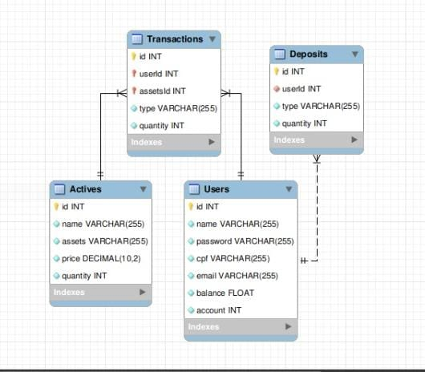

# App Investimento em ações - Xp Challange

## **Desenvolvimento:**

Aplicativo desenvolvido por Barbara Luiza Soares Rocha, para simular investimentos em ações, utilizando Express, Sequelize e MySql 

## Tecnologias utilizadas:

- Node.js
- Express - Gerenciamento de requisições
- Sequelize - ORM (Object-Relational Mappers)
- MySql - Database
- Joi - Validações
- JWT - Autentificação
- Mocha, chai, sinon, frisby - Testes unitários e integração

Além dessas tecnologias, foi utilizado outras bibliotecas para dar suporte na realização de testes, documentação, interação entre os arquivos e captura de erros: 

- path
- express-async-errors
- shell
- swagger

## Como rodar a aplicação:

`git clone git@github.com:BarbaralsRocha/xp-project.git`

`npm install`

Configurar as variáveis de ambiente em um aquivo **.env** seguindo o exemplo abaixo: 

```
NODE_ENV=development
API_PORT=3000

MYSQL_HOST=localhost
MYSQL_DB_NAME=steelInvestiment
MYSQL_USER=root
MYSQL_PASSWORD=password

JWT_SECRET=suaSenhaSecreta
```

É necessário que a variável **API_PORT** permaneça recebendo a porta **3000** para ser verificado nos testes.

Executar o comando `npm run restore` (Dropa o banco de dados caso já exista, cria e popula) 

### **Informações relevantes:**

Para restaurar o banco de dados rode o comando `npm run restore`.

Para executar a aplicação, rode o comando `npm run dev`

### Relação entre tabelas:



**Tabela 1 - User 1:N** 

**id** - id do usuário

**name** - nome do usuário

**password** - senha do usuário 

email - email do usuário

**cpf** - cpf do usuário

**balance** - saldo do usuário

**account** - conta do usuário

**Tabela 2 - Actives 1:N** 

**id** - id do ativo

**name** - nome do ativo

**assets** - papel do ativo

**price** - preço unitario do ativo

**quantity** - quantidade de ativos que a corretora possui

**Tabela 3 - Deposits 1:N** 

**id** - id do ativo

**userId** - Identificação do usuário

**type** - deposito/saque

**quantity** - valor depositado/sacado

**Tabela 4 - Transactions N:N (Usuários - ativos)**

**userId** - id do usuário

**assetId** - id do ativo

**type** - compra/venda

**quantity** - quantidade de ativos que o usuário comprou/vendeu

## **Regras de negocio:**

### **Endpoints:**

**A documentação do swagger esta disponível através do [http://localhost:3000/docs](http://localhost:3000/docs)**

**POST - /user** - Cadastro de usuário, não necessita de autentificação. Não será possível cadastrar caso o cliente já possua uma conta

**POST - /login** - Cliente só pode logar se já possuir uma conta cadastrada. Não será possível logar caso algum dos parâmetros seja inválido ou esteja vazio

**POST - /investimentos/comprar** - Necessita de um token para acessar essa rota.O cliente não pode comprar mais do que possui em carteira e nem efetuar a compra com a conta de outro usuário.

**POST - /investimentos/vender** - Necessita de um token para acessar essa rota.O cliente não pode vender mais do que possui em carteira e nem efetuar a venda com a conta de outro usuário.

**POST - conta/deposito** - Necessita de um token para acessar essa rota. Não será possível efetuar o deposito caso o codigo do cliente não seja encontrado.

**POST - conta/saque** - Necessita de um token para acessar essa rota. Não será possível efetuar o saque caso o código do cliente não seja encontrado.

**GET - conta/{id}** - Necessita de um token para acessar essa rota. Não será possível visualizar quanto o cliente possui de saldo caso o código do cliente não seja encontrado ou não exista

**GET - ativos/clientes/{id}** - Necessita de um token para acessar essa rota. Não será possível visualizar quais ativos os clientes possuem caso o código do cliente não seja informado ou não exista

**GET - ativos/{id}**  - Necessita de um token para acessar essa rota. Não será possível visualizar o ativos caso o código do ativo não seja informado ou não exista.

### Pontos de melhoria:

**Cobertura de testes unitários** 

 A cobertura de testes poderia ter sido mais ampla, mas foi o que consegui mapear dentro do prazo estabelecido. Além disso, os testes estão sendo realizados no banco de desenvolvimento.

**Criptografar senhas** 

Por não possuir domínio das bibliotecas e não ter tido tempo hábil para me desenvolver, não foi possível implementar essa função.

**Deploy da aplicação** 

Apresentei dificuldades no deploy da aplicação no heroku com o Sequelize + MySql. A biblioteca utilizada proporcionou dificuldades que não fui capaz de resolver.